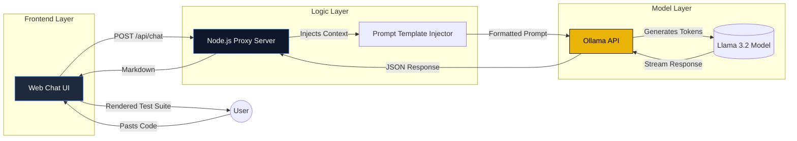

# AI Test Generator

A local, privacy-focused tool that generates comprehensive test suites for your code using the **Llama 3.2** LLM.


## 🏗️ Architecture & Flow

The application follows a **3-Layer Architecture** to ensure privacy and separation of concerns.



## 🚀 Getting Started

### Prerequisites
1.  **Node.js** (v14 or higher)
2.  **Ollama** (Installed and running)
    *   [Download Ollama](https://ollama.com/)
    *   Run: `ollama pull llama3.2`

### Installation
1.  Clone the repository:
    ```bash
    git clone https://github.com/VijayYadav123/AI-Test-Generator.git
    cd AI-Test-Generator
    ```
2.  Install dependencies:
    ```bash
    npm install
    ```

### Running the App
1.  Start the local server:
    ```bash
    node tools/server.js
    ```
2.  Open your browser to: **http://localhost:3000**

## 📂 Project Structure

*   `public/`: Frontend assets (Glassmorphism UI, Vanilla JS).
*   `tools/`: Backend tools and execution scripts.
    *   `server.js`: Connects the UI to your local Ollama instance.
*   `architecture/`: Technical SOPs and design docs.
*   `gemini.md`: Project Constitution and Schema definitions.

## 🛡️ Privacy
This tool runs **100% locally**. Your code and logic are never sent to the cloud.
